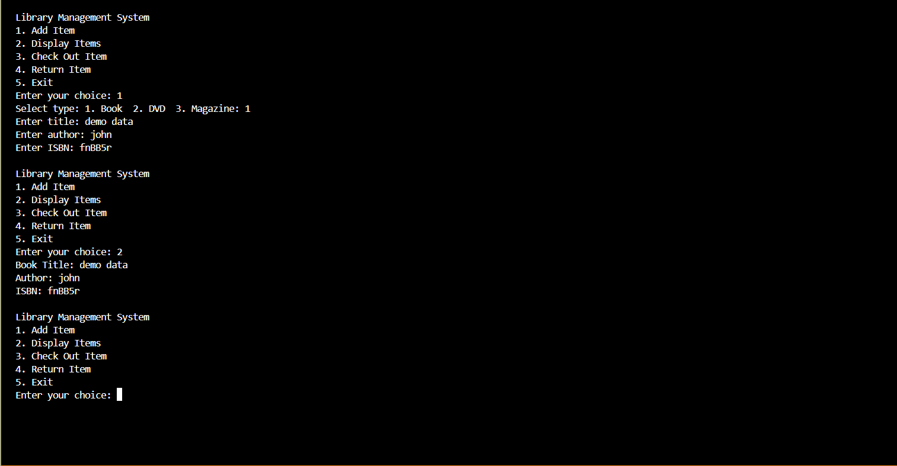

<h1 align="center">Library Management System_C++</h1>
 

<h3 align="center">Develop a Library Management System (LMS) in C++. The LMS should allow users to manage
books, patrons, and transactions. The system should demonstrate the principles of abstraction,
encapsulation, inheritance, and polymorphism.</h3>
 

 

>

